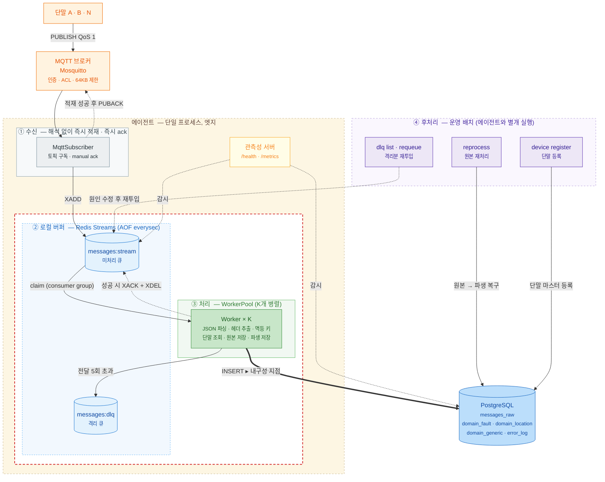
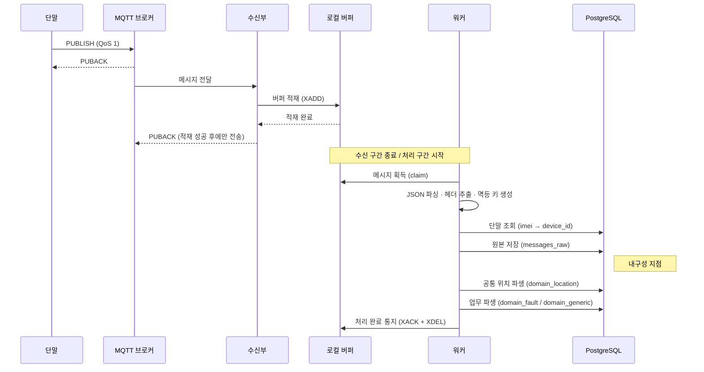
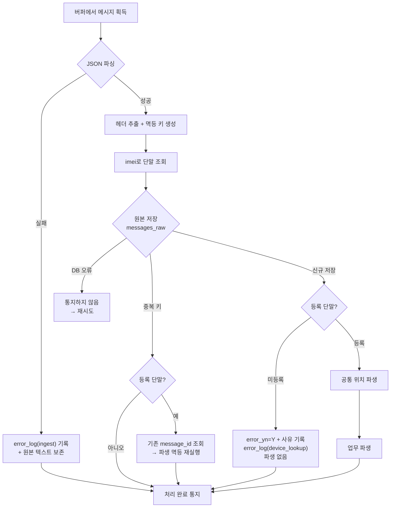
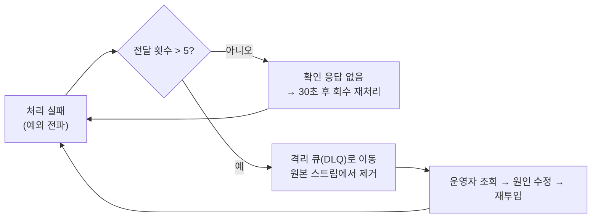
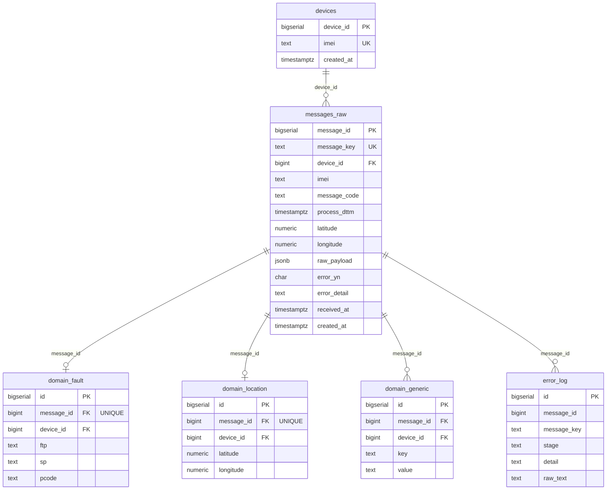

# 실시간 메시지 처리 프로세스 명세서

| 항목 | 내용 |
|---|---|
| 문서명 | 실시간 메시지 처리 프로세스 명세서 |
| 대상 시스템 | Edge Agent — 단말 메시지 실시간 수집 에이전트 |
| 기준일 | 2026-09-14 |
| 기준 소스 | 커밋 `de02035` |
| 문서 범위 | 처리 프로세스 · 데이터 모델 · 운영 · 장애 대응 · 보안 · 성능 검증 |

---

## 1. 개요

### 1.1 목적

단말기가 MQTT로 발행하는 JSON 메시지를 현장(엣지)에서 실시간 수신하여 **① 원본 보관 → ② 단말 식별 → ③ 업무별 파생 저장**의 3단계로 처리하고, 각 단계에서 발생한 오류를 추적 가능한 형태로 기록하는 것을 목적으로 한다.

본 시스템은 다음 세 가지를 설계 목표로 삼는다.

1. **무손실** — 수신된 메시지는 어떤 구성요소가 장애를 일으켜도 유실되지 않는다.
2. **무중복** — 재전송·재처리가 발생해도 동일 메시지가 두 번 저장되지 않는다.
3. **추적 가능** — 저장된 모든 데이터와 모든 오류는 원본 메시지 한 건으로 역추적된다.

### 1.2 적용 범위

| 구분 | 포함 | 제외 |
|---|---|---|
| 처리 대상 | 단말이 MQTT로 발행하는 JSON 메시지 | 단말 펌웨어, 단말 측 전송 로직 |
| 처리 구간 | MQTT 브로커 수신 ~ PostgreSQL 저장 완료 | 저장 이후의 조회·분석·시각화 |
| 운영 범위 | 에이전트 기동/감시/재처리/장애 대응 | 상위 관제 시스템 연동 |

### 1.3 시스템 구성도



> 이미지 파일: [architecture.svg](images/architecture.svg) (벡터, 문서 삽입용) · [architecture.png](images/architecture.png) (3172×2514, 슬라이드 붙여넣기용). 위 다이어그램 정의가 원본이며, 수정 시 이미지도 다시 내보낸다.

| 표기 | 의미 |
|---|---|
| **빨간 점선 영역** | 폭주 흡수의 핵심 — 버퍼와 처리부. 수신 속도와 저장 속도를 분리하는 구간 |
| **굵은 화살표** | 내구성 지점. 이 INSERT가 성공해야 메시지가 유실되지 않는다 |
| **점선 화살표** | 확인 응답(ack) 및 감시 경로 — 데이터 이동이 아님 |

에이전트는 **단일 프로세스**로 동작하며, 내부적으로 수신부(①)와 처리부(③)가 로컬 버퍼(②)를 경계로 분리되어 있다. 수신부는 메시지를 해석하지 않고 적재만 하므로 처리가 지연되어도 수신이 막히지 않는다. 이 분리가 순간 대량 발행(폭주)을 흡수하는 핵심 장치다. 후처리(④)는 에이전트와 별개로 실행되는 운영 배치로, 저장된 원본으로부터 누락분을 복구한다.

### 1.4 처리 원칙 요약

| 원칙 | 내용 |
|---|---|
| 폭주 흡수 | 수신 즉시 로컬 버퍼에 적재하고 곧바로 브로커에 ack하여, 브로커 송신 큐가 가득 차 메시지를 버리는 상황을 방지한다. |
| 원본 우선 | 원본 저장이 유일한 내구성 지점이다. 이후 단계가 실패해도 원본은 항상 보존된다. |
| 비치명 격리 | 원본 저장 이후의 파생 실패는 재시도를 유발하지 않고 오류로 기록·격리한다. 특정 메시지가 무한 재시도로 처리를 막는 상황을 방지한다. |
| 복구 가능 | 파서 수정·단말 등록 이후 원본만으로 파생 데이터를 복구한다. 단말에 재전송을 요청할 필요가 없다. |

---

## 2. 구성 요소

| 구성 요소 | 역할 | 책임 경계 |
|---|---|---|
| **단말** | JSON 메시지를 QoS 1로 발행 | 발행까지. 브로커 ack 수신 후 책임 종료 |
| **MQTT 브로커** (Mosquitto 2) | 메시지 중계, 인증·인가, 세션 보관 | 구독자가 ack하기 전까지 메시지 보관·재전송 |
| **수신부** (`MqttSubscriber`) | 토픽 구독, 메시지를 버퍼에 적재, 적재 성공 후에만 브로커에 ack | 버퍼 적재까지. 내용 해석 없음 |
| **로컬 버퍼** (Redis Streams) | 수신량과 처리량의 속도 차 흡수, 미처리분 보관 | 워커가 처리 완료를 통지할 때까지 엔트리 보관 |
| **워커 풀** (`WorkerPool`, K개) | 버퍼에서 메시지를 가져와 처리, 실패 시 재시도·격리 | 처리 완료 통지, 재시도 한도 관리 |
| **처리 오케스트레이터** (`MessageProcessor`) | 메시지 1건의 전 단계 처리 | 파싱 → 단말 식별 → 원본 저장 → 파생 저장 |
| **PostgreSQL 16** | 원본·업무 파생·오류 영구 저장 | 최종 데이터 보관, 제약 조건에 의한 무결성 보장 |
| **관측성 서버** | 헬스체크·운영 지표 노출 | 상태 제공. 처리에는 관여하지 않음 |
| **운영 도구 (CLI)** | 단말 등록, 원본 재처리, 격리 메시지 조회·재투입 | 에이전트와 독립 실행 |

> 에이전트 프로세스와 무관하게 브로커·Redis·PostgreSQL은 별도 컨테이너로 기동한다. 세 구성요소 모두 재기동 후 데이터가 보존되도록 영속화 설정되어 있다.

---

## 3. 처리 프로세스

### 3.1 전체 흐름

메시지 한 건은 **수신 구간**과 **처리 구간**을 순차로 통과한다. 두 구간은 로컬 버퍼를 경계로 분리되어 서로의 속도에 영향받지 않는다.



### 3.2 단계별 상세

#### 1단계 — 수신 및 버퍼 적재

| 항목 | 내용 |
|---|---|
| 입력 | MQTT PUBLISH 패킷 (토픽 + 페이로드) |
| 처리 | 페이로드를 해석하지 않고 그대로 버퍼에 적재한다. 적재 항목은 `topic`, `payload`(원본 텍스트), `receivedAt`(수신 시각) 세 가지다. |
| 출력 | 버퍼 엔트리 1건 |
| 성공 시 | 브로커에 PUBACK 전송 → 브로커가 해당 메시지를 세션에서 제거 |
| 실패 시 | PUBACK을 전송하지 않는다. 브로커가 세션에 보관했다가 재전송한다. |

수신부는 메시지 내용을 전혀 해석하지 않는다. 파싱·검증·저장을 모두 처리 구간으로 미루기 때문에 수신 처리 시간이 짧고, 그만큼 브로커 송신 큐가 빠르게 비워진다. 이것이 폭주 흡수의 원리다.

#### 2단계 — 메시지 획득

| 항목 | 내용 |
|---|---|
| 입력 | 버퍼의 미처리 엔트리 |
| 처리 | K개 워커가 consumer group으로 엔트리를 나누어 가져간다. 하나의 엔트리는 정확히 한 워커에만 배정된다. |
| 부가 처리 | 매 루프마다 **회수(reclaim)** 를 먼저 수행한다. 30초 이상 처리 완료 통지가 없는 엔트리를 다른 워커가 회수하여 재처리한다. |

각 워커는 **전용 Redis 연결**을 사용한다. 블로킹 대기 명령이 수신부의 적재나 다른 워커의 동작을 막지 않도록 하기 위함이다.

#### 3단계 — JSON 파싱

| 항목 | 내용 |
|---|---|
| 입력 | 원본 텍스트 |
| 처리 | JSON 파싱 |
| 실패 시 | `error_log`에 `stage=ingest`와 원본 텍스트를 기록하고 **처리 완료로 간주**한다. 재시도해도 결과가 같으므로 재처리하지 않는다. |

#### 4단계 — 공통 헤더 추출 및 멱등 키 생성

| 항목 | 내용 |
|---|---|
| 입력 | 파싱된 JSON |
| 처리 | 공통 헤더 5개 필드(`imei`, `messageCode`, `process_dttm`, `latitude`, `longitude`)를 추출한다. 원본은 변형하지 않는다. |
| 멱등 키 | `payload.messageId`가 있으면 그 값을 사용하고, 없으면 `토픽의 단말 구분자 + 원본 텍스트`의 SHA-256 해시를 사용한다. 동일 메시지가 재전송되면 항상 같은 키가 나온다. |

#### 5단계 — 단말 식별

| 항목 | 내용 |
|---|---|
| 입력 | 헤더의 `imei` |
| 처리 | `devices` 테이블에서 `imei`에 대응하는 `device_id`를 조회한다. |
| 미등록 시 | `device_id`는 NULL로 두고 처리를 계속한다(원본은 저장한다). |
| DB 오류 시 | 예외를 던져 처리 완료 통지를 하지 않는다 → 재시도 대상이 된다. |

#### 6단계 — 원본 저장 (내구성 지점)

| 항목 | 내용 |
|---|---|
| 입력 | 멱등 키, `device_id`, 공통 헤더, 원본 JSON, 오류 여부 |
| 처리 | `messages_raw`에 `ON CONFLICT (message_key) DO NOTHING`으로 INSERT하고 생성된 `message_id`를 돌려받는다. |
| 신규 저장 | `message_id`를 반환 → 7·8단계로 진행 |
| 중복 감지 | 반환값 없음 → 기존 `message_id`를 조회하여 **파생 단계를 멱등 재실행**한다(3.3 참조). |
| 실패 시 | 예외 → 처리 완료 통지를 하지 않음 → 재시도 |

이 단계가 시스템의 **유일한 내구성 지점**이다. 여기까지 성공하면 메시지는 유실되지 않는다. 미등록 단말의 메시지도 `error_yn='Y'`와 사유를 붙여 원본을 저장한다.

#### 7단계 — 공통 위치 파생

| 항목 | 내용 |
|---|---|
| 조건 | 등록 단말이고 `latitude`·`longitude`가 모두 존재할 때만 수행 |
| 처리 | `domain_location`에 저장(`ON CONFLICT (message_id) DO NOTHING`) |
| 위치 없음 | 저장을 건너뛴다. 오류가 아니다. |
| 실패 시 | `messages_raw.error_yn='Y'` + `error_detail` 갱신, `error_log`에 `stage=location` 기록. 처리는 정상 종료한다(비치명). |

위치는 업무 코드와 무관하게 모든 등록 단말 메시지에서 동일하게 분리된다.

#### 8단계 — 업무 파생

| 항목 | 내용 |
|---|---|
| 조건 | 등록 단말 |
| 처리 | `messageCode`로 전용 파서를 조회한다.<br/>· **전용 파서 있음** → 파서가 본문을 해석하여 전용 테이블에 저장 (예: `Fault` → `domain_fault`)<br/>· **전용 파서 없음** → 본문의 키마다 한 행씩 `domain_generic`에 저장 |
| 본문 판별 | 페이로드에 `message` 객체가 있으면 그 객체를, 없으면 공통 헤더 5개 키를 제외한 나머지 최상위 키를 업무 본문으로 본다. |
| 크기 제한 | 전용 파서가 없는 경우 본문 키 200개를 초과하면 오류로 처리한다(단일 메시지에 의한 행 폭주 방지). |
| 실패 시 | `messages_raw.error_yn='Y'` + `error_detail` 갱신, `error_log`에 `stage=projection` 기록. 처리는 정상 종료한다(비치명). |

#### 9단계 — 처리 완료 통지

워커는 `MessageProcessor.handle()`이 정상 반환하면 버퍼에 처리 완료를 통지한다(XACK + XDEL, 원자 실행). 7·8단계는 내부에서 예외를 흡수하므로, **실질적인 재시도 경계는 6단계(원본 저장)** 다. 원본 저장에 성공하면 이후 무엇이 실패해도 재시도는 발생하지 않고 오류 기록으로 격리된다.

### 3.3 처리 분기



**중복 감지 시 파생 재실행**은 다음 상황을 복구하기 위한 장치다. 원본 저장 직후 프로세스가 비정상 종료되면 파생 저장이 누락된 채 원본만 남는다. 이후 재시도로 같은 메시지가 다시 들어오면 원본은 중복으로 판정되지만, 이때 파생을 다시 실행하여 누락분을 채운다. 모든 파생 테이블의 INSERT가 `ON CONFLICT DO NOTHING`이므로 이미 저장된 경우에도 안전하다.

### 3.4 처리 예시

#### 예시 1 — 전용 파서가 있는 업무 코드 (`Fault`)

입력 메시지 (토픽 `device/A/msg`)

```json
{
  "imei": "IMEI-001",
  "messageCode": "Fault",
  "process_dttm": "2026-09-14T10:23:45+09:00",
  "latitude": "37.5665",
  "longitude": "126.9780",
  "message": { "ftp": "1", "sp": "0", "pcode": "E102" }
}
```

저장 결과

| 테이블 | 행 수 | 내용 |
|---|---|---|
| `messages_raw` | 1 | 원본 JSON 전체 + 공통 헤더 + `device_id` + `error_yn='N'` |
| `domain_location` | 1 | 위도 37.5665 / 경도 126.9780 |
| `domain_fault` | 1 | `ftp='1'`, `sp='0'`, `pcode='E102'` |
| `error_log` | 0 | — |

#### 예시 2 — 전용 파서가 없는 업무 코드 (`Common`)

입력 메시지

```json
{ "imei": "IMEI-001", "messageCode": "Common", "seq": 1, "v1": 10, "v2": 20 }
```

저장 결과

| 테이블 | 행 수 | 내용 |
|---|---|---|
| `messages_raw` | 1 | 원본 JSON 전체 + 공통 헤더 |
| `domain_location` | 0 | 위/경도 없음 → 저장 생략(오류 아님) |
| `domain_generic` | 3 | `seq=1`, `v1=10`, `v2=20` (키마다 한 행) |
| `error_log` | 0 | — |

#### 예시 3 — 미등록 단말

입력 메시지의 `imei`가 `devices`에 없는 경우

| 테이블 | 행 수 | 내용 |
|---|---|---|
| `messages_raw` | 1 | 원본 보존, `device_id=NULL`, `error_yn='Y'`, `error_detail='unregistered imei: ...'` |
| `domain_*` | 0 | 파생 없음 |
| `error_log` | 1 | `stage='device_lookup'` |

단말을 등록한 뒤 재처리 배치(8.4)를 실행하면 이 원본에서 파생 데이터가 생성되고 오류 표시가 해제된다.

---

## 4. 처리 보장

### 4.1 무손실 (at-least-once)

무손실은 **2단 확인 응답**으로 성립한다.

| 구간 | 확인 응답 시점 | 실패 시 동작 |
|---|---|---|
| 브로커 → 수신부 | 버퍼 적재 성공 후 PUBACK | PUBACK 미전송 → 브로커가 재전송. 수신부는 `clean:false`(durable) 세션과 고정 clientId를 사용하므로 재접속 후에도 미확인 메시지를 받는다. |
| 버퍼 → 워커 | **원본 저장 성공** 후 XACK | XACK 미전송 → 30초 이상 방치된 엔트리를 다른 워커가 회수하여 재처리 |

즉 어느 지점에서 장애가 발생해도 해당 메시지의 소유권은 직전 단계에 남아 있다. 확인 응답은 항상 "다음 단계가 책임을 인수한 뒤"에만 전송된다.

**전제 조건 — 브로커 큐 용량:** Mosquitto의 기본값 `max_queued_messages=1000`은 순간 대량 발행 시 1,000건을 초과한 분량을 **브로커가 폐기**한다(에이전트 도달 전 유실). 본 시스템은 `max_queued_messages 0`(무제한)과 `max_inflight_messages 1000`을 설정하여 이를 방지한다. 브로커 큐 상향과 에이전트의 즉시 ack가 **함께 있어야** 폭주 무손실이 성립한다(11장 검증 결과 참조).

### 4.2 무중복 (멱등)

at-least-once 전달은 중복 수신을 허용하므로, 중복은 저장 단계에서 흡수한다.

- `messages_raw.message_key`가 TEXT UNIQUE 제약을 가진다.
- 원본 INSERT는 `ON CONFLICT (message_key) DO NOTHING`이다.
- 멱등 키는 **결정적으로** 유도된다(4단계 참조). 같은 메시지는 몇 번을 재전송해도 같은 키가 된다.
- 모든 파생 테이블의 INSERT도 `ON CONFLICT DO NOTHING`이다. `domain_fault`·`domain_location`은 `message_id` UNIQUE, `domain_generic`은 `(message_id, key)` UNIQUE를 사용한다.

이 구조는 K개 워커의 병렬 처리와 회수 재시도가 동시에 일어나도 안전하다. 중복 판정을 애플리케이션 로직이 아닌 **데이터베이스 제약 조건**이 수행하기 때문이다.

### 4.3 원본 불변성

`messages_raw`는 진실의 원천이다. 원본 JSON은 변형 없이 JSONB로 보존되며, 어떤 후속 단계가 실패해도 원본 행은 남는다. 따라서 파서 결함이나 단말 등록 누락은 **단말 재전송 없이** 원본만으로 복구할 수 있다(8.4).

> 운영 중 `messages_raw`에 대한 임의 UPDATE/DELETE는 금지한다. 데이터 정정은 항상 재처리 도구를 통해 수행한다.

### 4.4 순서에 대한 명시

본 시스템은 **메시지 처리 순서를 보장하지 않는다.** K개 워커가 병렬로 처리하므로 수신 순서와 저장 순서가 일치하지 않을 수 있다. 시간 순 정렬이 필요한 조회는 저장 순서가 아니라 다음 시각 컬럼을 기준으로 수행해야 한다.

| 컬럼 | 의미 |
|---|---|
| `messages_raw.process_dttm` | 단말이 기록한 업무 처리 시각 (페이로드 값) |
| `messages_raw.received_at` | 에이전트가 원본 저장 시점에 기록한 시각 (버퍼 적체 시 실제 MQTT 수신 시각보다 늦어질 수 있음) |
| `messages_raw.created_at` | 데이터베이스 행 생성 시각 |

### 4.5 보장 요약

| 보장 | 성립 근거 | 검증 |
|---|---|---|
| 무손실 | 2단 확인 응답 + 브로커 큐 무제한 + 로컬 버퍼 영속화(AOF everysec) | 20,000건 폭주 시 손실 0 (11장) |
| 무중복 | `message_key` UNIQUE + 전 단계 `ON CONFLICT DO NOTHING` | distinct 키 20,000 = 저장 20,000 (11장) |
| 원본 보존 | 원본 저장이 파생보다 선행, 파생 실패는 비치명 | 미등록/파서 오류 시에도 원본 100% 보존 |
| 재시도 종료성 | 재시도 한도(5회) 초과 시 격리 큐로 이동 | 무한 재시도 없음 |
| 순서 | **보장하지 않음** (병렬 처리) | 시각 컬럼으로 정렬 |

---

## 5. 예외 처리

### 5.1 오류 분류

모든 오류는 `error_log` 테이블에 `message_id`(또는 멱등 키)와 단계(`stage`)를 붙여 기록한다. 단계는 네 가지다.

| stage | 발생 지점 | 원인 예 | 원본 저장 | 파생 저장 | 재시도 |
|---|---|---|---|---|---|
| `ingest` | 3단계 JSON 파싱 | 손상된 페이로드, 비 JSON 데이터 | ✗ (원본 텍스트만 `error_log`에 보존) | ✗ | 없음 |
| `device_lookup` | 5단계 단말 식별 | `devices`에 미등록된 imei | ○ (`error_yn='Y'`) | ✗ | 없음 |
| `location` | 7단계 위치 파생 | 위/경도 형식 오류, DB 제약 위반 | ○ | 부분 | 없음 |
| `projection` | 8단계 업무 파생 | 파서 예외, 본문 키 200개 초과, DB 제약 위반 | ○ (`error_yn='Y'`) | ✗ | 없음 |

원본 저장 이전의 인프라 오류(단말 조회 실패, 원본 INSERT 실패)는 `error_log`에 기록하지 않고 **예외로 전파**하여 재시도 경로를 탄다.

`location`·`projection` 단계의 실패는 `error_log` 기록과 함께 `messages_raw.error_yn`을 `'Y'`로 표시한다. 재처리 배치(8.4)가 `error_yn='Y'` 행을 대상으로 하므로, 두 단계의 실패 모두 원인 수정 후 자동 복구 대상이 된다.

### 5.2 오류 표시의 이중 구조

| 위치 | 용도 |
|---|---|
| `messages_raw.error_yn` / `error_detail` | 해당 원본에 문제가 있음을 나타내는 **요약 플래그**. 재처리 대상 선별에 사용한다. |
| `error_log` | 단계·시각·상세 메시지를 담은 **이력**. 한 원본에 여러 건이 쌓일 수 있다. |

### 5.3 재시도와 격리



- **재시도 대상**: 원본 저장 이전 단계의 인프라 오류만 해당한다. 데이터베이스 일시 장애가 대표적이다.
- **재시도 방식**: 확인 응답을 보내지 않으면 30초 후 다른 워커가 해당 엔트리를 회수하여 다시 처리한다. 전달 횟수는 버퍼가 실제로 집계한 값을 사용한다.
- **격리(DLQ)**: 전달 횟수가 5회를 넘으면 격리 큐 `messages:dlq`로 옮기고 원본 스트림에서 제거한다. 특정 메시지가 영원히 재시도되며 처리를 막는 상황을 방지한다.
- **격리 이동의 원자성**: 격리 큐 적재와 원본 스트림 제거를 하나의 트랜잭션(MULTI)으로 실행하여, 중간 장애 시 중복 적재나 엔트리 잔류가 생기지 않는다.
- **재투입**: 원인을 수정한 뒤 운영 도구로 재투입하면 새 엔트리로 적재되어 전달 횟수가 초기화되고 처음부터 다시 처리된다(8.5).

### 5.4 복구 경로 요약

| 오류 유형 | 자동 복구 | 수동 복구 |
|---|---|---|
| 데이터베이스 일시 장애 | 회수 재처리로 자동 복구 | — |
| 프로세스 비정상 종료 | 재기동 후 회수 재처리, 파생 누락분은 중복 재수신 시 자동 보완 | — |
| 미등록 단말 | 없음 | 단말 등록(8.3) → 재처리 배치(8.4) |
| 파서 결함 | 없음 | 파서 수정·배포 → 재처리 배치(8.4) |
| 반복 실패 메시지 | 격리 | 원인 수정 → 격리 큐 재투입(8.5) |
| 손상된 페이로드 | 없음 (재시도 무의미) | `error_log.raw_text`로 원인 분석 |

---

## 6. 데이터 모델

### 6.1 개체 관계



### 6.2 테이블 개요

| 테이블 | 계층 | 역할 | 핵심 제약 |
|---|---|---|---|
| `devices` | 마스터 | 단말 관리 키(`device_id`)와 하드웨어 식별자(`imei`) 매핑 | PK `device_id`, UNIQUE `imei` |
| `messages_raw` | 원본 (bronze) | 단말 원본 JSON + 공통 헤더. 불변 | PK `message_id`, **UNIQUE `message_key`**(멱등) |
| `domain_fault` | 파생 (silver) | 고장 업무 (`messageCode='Fault'`) | UNIQUE `message_id` |
| `domain_location` | 파생 (silver) | 공통 위치 (업무 코드 무관, 등록 단말) | UNIQUE `message_id` |
| `domain_generic` | 파생 (silver) | 전용 파서가 없는 업무의 본문. 키:값 한 행씩 | UNIQUE `(message_id, key)` |
| `error_log` | 이력 | 단계별 오류 추적 | 인덱스 `message_id`, `(stage, created_at)` |

- 모든 테이블은 `created_at TIMESTAMPTZ NOT NULL DEFAULT now()`를 가진다.
- 모든 업무 파생 테이블은 단말별 조회를 위해 `device_id BIGINT NOT NULL`을 가진다.
- 전체 DDL과 컬럼 코멘트는 [src/db/schema.sql](../src/db/schema.sql)에 있으며, 에이전트 기동 시 `IF NOT EXISTS`로 멱등 적용된다.

### 6.3 키 설계

| 키 | 종류 | 용도 |
|---|---|---|
| `message_key` | 자연키(결정적 유도) | **멱등 판정 전용**. 중복 수신 흡수. 문자열 |
| `message_id` | 대체키(BIGSERIAL) | **전 계층 매핑 키**. 파생·오류 테이블이 참조 |
| `device_id` | 대체키(BIGSERIAL) | 단말 관리 키. 파생 테이블이 보유 |
| `imei` | 자연키 | 단말 하드웨어 식별자. 미등록 추적용으로 원본에도 보관 |

멱등 키를 그대로 PK로 쓰지 않고 숫자 대체키를 두는 이유는, 파생 테이블의 조인 비용과 인덱스 크기를 줄이고 단말 식별 스펙 변경 시 영향 범위를 원본 테이블로 한정하기 위함이다.

### 6.4 인덱스

| 테이블 | 인덱스 | 목적 |
|---|---|---|
| `messages_raw` | `(received_at) WHERE error_yn='Y'` | 재처리 대상 선별 (부분 인덱스) |
| `messages_raw` | `(message_code, received_at)` | 업무 코드별 시간 범위 조회 |
| `messages_raw` | `(device_id, received_at)` / `(imei, received_at)` | 단말별 이력 조회 |
| `domain_*` | `(device_id)` | 단말별 업무 조회 |
| `domain_generic` | `(message_id)`, `(key)` | 원본 역추적, 키별 조회 |
| `error_log` | `(message_id)`, `(stage, created_at)` | 원본 역추적, 단계별 오류 분포 |

### 6.5 추적 조회

메시지 한 건의 원본·단말·업무·위치·오류를 한 번에 조회한다.

```sql
SELECT d.imei, r.message_code, r.error_yn, r.error_detail,
       f.ftp, f.sp, f.pcode,
       l.latitude, l.longitude,
       e.stage AS error_stage, e.detail AS error_log_detail
FROM messages_raw r
LEFT JOIN devices         d USING (device_id)
LEFT JOIN domain_fault    f USING (message_id)
LEFT JOIN domain_location l USING (message_id)
LEFT JOIN error_log       e USING (message_id)
WHERE r.message_id = $1;
```

### 6.6 SQL 관리 방식

모든 쿼리는 소스 코드가 아닌 프로젝트 루트 `mappers/<대상>.xml`에 분리 보관한다(MyBatis 형식). 로더가 `#{name}` 표기를 PostgreSQL 위치 파라미터(`$1`)로 변환하고 값을 별도 바인딩하므로, **모든 쿼리가 파라미터라이즈드 쿼리로 실행되어 SQL 인젝션이 구조적으로 차단**된다.

---

## 7. 업무 확장

### 7.1 라우팅 규칙

`messageCode` 값에 따라 저장 대상이 결정된다.

| 조건 | 저장 대상 | 형태 |
|---|---|---|
| 전용 파서가 등록된 코드 (현재 `Fault`) | `domain_<code>` | 타입 컬럼 |
| 그 외 모든 코드 | `domain_generic` | 키:값 한 행씩 (EAV) |

전용 파서가 없어도 데이터는 유실되지 않고 `domain_generic`에 저장되며 `error_yn='N'`으로 정상 처리된다. 따라서 **신규 업무 코드가 사전 통보 없이 유입되어도 수집이 중단되지 않는다.**

### 7.2 신규 업무 추가 절차

전용 테이블이 필요한 업무 코드만 아래 절차로 추가한다. 기존 코드는 수정하지 않고 **추가만 한다**(개방-폐쇄 원칙).

| 순서 | 작업 | 대상 |
|---|---|---|
| 1 | 테이블 정의 추가 (`domain_<code>`) | `src/db/schema.sql` |
| 2 | INSERT 쿼리 추가 | `mappers/domain.xml` |
| 3 | 저장 메서드 추가 | `src/repo/domainRepo.ts` |
| 4 | 파서 구현 (해석 로직은 순수 함수) | `src/parsers/<code>Parser.ts` |
| 5 | 파서 등록 | `src/parsers/registry.ts` |
| 6 | 단위 테스트 + 필요 시 통합 테스트 | `*.test.ts` |

기존에 `domain_generic`으로 저장된 해당 코드의 과거 데이터는 재처리 배치(8.4)로는 전용 테이블에 옮겨지지 않는다(재처리는 `error_yn='Y'` 행만 대상으로 한다). 소급 이관이 필요하면 별도 마이그레이션을 수행한다.

---

## 8. 운영

> 아래 값은 기본 설정 기준이다. 포트: MQTT `1883`/`9001`, PostgreSQL `5435`, Redis `6379`, 관측성 HTTP `9100`.

### 8.1 기동 / 종료

```bash
# 의존 서비스 기동 (Mosquitto + PostgreSQL + Redis)
docker compose up -d

# 에이전트 기동 (스키마는 기동 시 자동 적용)
npm run build && npm start

# 운영 권장: 에이전트를 컨테이너로 기동 (크래시 자동 재기동 + 헬스체크)
docker compose --profile agent up -d --build
```

종료는 SIGINT/SIGTERM으로 수행한다. 에이전트는 **수신 중단 → 워커 드레인 → 연결 정리** 순으로 정상 종료(graceful shutdown)하며, 신호를 중복 수신해도 종료 절차는 한 번만 실행된다.

컨테이너 기동 시 `restart: unless-stopped` 정책과 `/health` 기반 HEALTHCHECK(15초 주기)가 적용되어, 프로세스가 비정상 종료되면 자동으로 재기동된다.

### 8.2 상태 감시

| 엔드포인트 | 응답 | 용도 |
|---|---|---|
| `GET /health` | `{"ok":true,"mqtt":true,"redis":true,"pg":true}` — 셋 중 하나라도 실패하면 HTTP 503 | liveness / readiness 프로브 |
| `GET /metrics` | Prometheus 텍스트 | 지표 수집 |

주요 지표와 권장 경보 기준:

| 지표 | 유형 | 의미 | 경보 기준 |
|---|---|---|---|
| `agent_stream_backlog` | gauge | 버퍼 미처리 잔량 | 지속 증가 시 저장 지연 의심 |
| `agent_stream_pending` | gauge | 워커가 가져갔으나 미완료 | 고착 시 워커/DB 장애 의심 |
| `agent_dlq_depth` | gauge | 격리 큐 적재 건수 | 0 초과 시 8.5 절차 |
| `agent_raw_error_rows` | gauge | `error_yn='Y'` 원본 건수 | 증가 시 8.4 검토 |
| `agent_error_log_total{stage}` | gauge | 단계별 오류 누적 건수 | 단계별 원인 분석 |
| `agent_processed_total` | counter | 처리 성공 누적 | 처리율 = `rate()`. 유입 대비 급락 시 병목 |
| `agent_process_failed_total` | counter | 처리 실패(재시도) 누적 | 증가 추세면 DB/파서 점검 |
| `agent_dlq_moved_total` | counter | 격리 이동 누적 | 0 초과 시 반복 실패 이력 존재 |
| `agent_e2e_latency_ms_sum` | counter | 수신→처리완료 지연 합 | 평균 = `rate(sum)/rate(processed_total)` |
| `agent_e2e_latency_ms_max` | gauge | 최대 지연 | 스파이크 분석 |

로그는 `LOG_DIR`(기본 `./logs`)의 `agent.log`에 JSON 한 줄 형식으로 기록되며, 날짜가 바뀌면 `agent-YYYY-MM-DD.log`로 자동 백업된다(기동 시·60초 주기·기록 시 확인).

### 8.3 단말 등록

메시지가 파생 처리되려면 해당 `imei`가 `devices`에 등록되어 있어야 한다.

```bash
npm run device -- register IMEI-001   # 등록 (멱등)
npm run device -- list                # 등록 목록
```

미등록으로 적체된 단말 확인:

```sql
SELECT imei, count(*) FROM messages_raw
WHERE error_yn='Y' AND device_id IS NULL
GROUP BY imei;
```

### 8.4 원본 재처리

```bash
npm run reprocess
```

`error_yn='Y'`인 원본을 순회하며 원본 JSON으로부터 파생을 복구한다.

| 대상 | 동작 |
|---|---|
| 미등록이었던 행 (`device_id` NULL) | `imei` 재조회 → 등록되었으면 단말 매핑 + 오류 해제 + 파생 실행. 여전히 미등록이면 건너뜀 |
| 파생 실패 행 (`device_id` 존재) | 오류 해제 후 파생 재실행 (수정된 파서 반영) |

에이전트 기동 중에도 실행할 수 있으며, 반복 실행해도 안전하다(모든 파생 INSERT가 멱등). 완료 시 `scanned` / `reprocessed` / `stillUnregistered` 요약이 로그에 남는다. 재처리 중 다시 실패한 행은 `error_yn='Y'`로 유지되어 다음 실행에서 재시도된다.

### 8.5 격리 메시지(DLQ) 처리

```bash
npm run dlq -- list          # 적재분 조회 (오래된 순, 기본 20건)
npm run dlq -- list 100
npm run dlq -- requeue               # 전부 재투입
npm run dlq -- requeue <엔트리ID>     # 특정 건만 재투입
```

원인(파서 결함, 스키마 불일치 등)을 수정·배포한 뒤 재투입한다. 재투입과 격리 큐 삭제는 하나의 트랜잭션으로 실행되어 중복 재투입이 발생하지 않는다.

### 8.6 성능 조정

처리 워커 수 `WORKER_CONCURRENCY`(기본 4)가 버퍼→데이터베이스 드레인 속도를 결정한다. 수신 속도는 이 값과 무관하다.

**늘려야 하는 신호**: 유입 피크마다 `agent_stream_backlog`가 쌓이고 해소가 느리며, 평균 지연이 지속 상승하고, 이때 데이터베이스에 자원 여유가 있는 경우.

**늘려도 효과가 없는 경우**: 데이터베이스가 이미 포화 상태이거나, 적체 원인이 데이터베이스 장애인 경우.

**비용**: 워커를 늘리면 PostgreSQL 연결이 `K+4`개, Redis 연결이 `K+1`개로 함께 증가한다. `max_connections`와 다른 클라이언트(재처리 배치 등)의 몫을 고려해야 한다.

권장 시작점은 4이며, 예상 피크 유입률의 2~3배 드레인 처리율이 확보되는 최소값을 대상 장비에서 실측하여 결정한다.

---

## 9. 장애 대응

| 상황 | 증상 | 자동 동작 | 수동 조치 |
|---|---|---|---|
| **데이터베이스 다운** | `/health` `pg=false`, `agent_stream_backlog` 증가 | 수신은 정상 지속, 처리분은 버퍼에 적체. 복구 시 워커가 자동 드레인 (무손실) | 데이터베이스 복구. 장기화 시 Redis 메모리 여유 감시 |
| **버퍼(Redis) 다운** | `/health` `redis=false`, 적재 실패 로그 | 미적재분은 브로커에 ack되지 않아 브로커가 재전송 | Redis 복구. AOF로 기존 잔량·미완료 상태 자동 복원 |
| **브로커 다운** | `/health` `mqtt=false` | 2초 주기로 자동 재접속. durable 세션이므로 미확인 메시지 재전송 | 브로커 복구 |
| **에이전트 비정상 종료** | 프로세스 종료 | 컨테이너 운영 시 자동 재기동. 미완료 엔트리는 30초 후 회수 재처리. 원본 저장 직후 종료된 건은 중복 재수신 시 파생 자동 보완 | 재기동 확인 |
| **반복 실패 메시지 누적** | `agent_dlq_depth` 증가 | 5회 초과 시 자동 격리 (전체 처리는 계속 진행) | 원인 수정 → 8.5 재투입 |
| **미등록 단말 유입** | `agent_raw_error_rows` 증가, `stage=device_lookup` | 원본만 보존 | 8.3 등록 → 8.4 재처리 |
| **순간 폭주** | `agent_stream_backlog` 급증 후 감소 | 버퍼가 흡수, 워커가 순차 드레인 | 해소가 느리면 8.6으로 워커 수 조정 |

### 복구 시 데이터 무결성

버퍼(Redis)는 AOF(`appendfsync everysec`)로 영속화되어 있다. 프로세스를 강제 종료한 뒤 재기동해도 **스트림 잔량·미완료(pending) 상태·consumer group이 모두 복원**됨을 자동 테스트로 검증하였다([src/buffer/redisDurability.test.ts](../src/buffer/redisDurability.test.ts)).

---

## 10. 보안

### 10.1 적용 항목

| 영역 | 조치 |
|---|---|
| MQTT 인증 | 익명 접속 차단(`allow_anonymous false`) + 계정 파일 인증. 에이전트/운영용 계정과 단말 공용 계정을 분리 |
| MQTT 인가 | ACL 적용. 단말은 **자기 clientId와 일치하는 토픽**(`device/%c/msg`)에만 발행 가능하여 타 단말 사칭이 차단된다. 구독 권한은 에이전트 계정만 보유 |
| 입력 크기 제한 | 브로커 `message_size_limit 65536`(64KB). 초과 메시지는 브로커가 차단 |
| 파생 행 폭주 방지 | 전용 파서가 없는 업무의 본문 키 200개 상한. 초과 시 오류로 격리 |
| Redis 인증 | `requirepass` 적용. 클라이언트는 접속 URL에 자격 증명 포함 |
| 네트워크 노출 | **외부 공개는 MQTT(1883/9001)뿐.** PostgreSQL(5435)·Redis(6379)·관측성(9100)은 호스트 `127.0.0.1`에만 바인딩 |
| SQL 인젝션 | 모든 쿼리가 파라미터라이즈드 쿼리로 실행(6.6) |
| 컨테이너 권한 | 에이전트 컨테이너는 비 root 사용자(`USER node`)로 실행 |
| 자격 증명 관리 | compose 파일에 평문 상수 대신 환경변수 주입(`${POSTGRES_PASSWORD:-...}` 형식) |

### 10.2 미적용 항목 (고지)

| 항목 | 현황 | 비고 |
|---|---|---|
| **전송 구간 암호화(TLS)** | 미적용 | MQTT(8883)·Redis·PostgreSQL 모두 평문. 인증서 체계 등 인프라 정책 확정 후 적용 필요 |
| **페이로드 imei와 토픽 단말 구분자 대조** | 미적용 | ACL로 토픽 사칭은 차단되나, 페이로드 내 `imei` 위조는 검증하지 않음. 단말 식별 스펙 확정 후 적용 필요 |
| **기본 계정 교체** | 개발 기본값 사용 중 | **운영 배포 시 반드시 교체.** PostgreSQL·Redis는 `.env` 주입으로 즉시 교체 가능, MQTT는 `mosquitto_passwd` 재생성 필요 |

---

## 11. 성능 및 신뢰성 검증

### 11.1 폭주 무손실 검증

**시험 목적**: 순간 대량 발행 시 무손실·무중복 저장 여부 확인
**시험 환경**: Windows 11 + Docker Compose 단일 호스트 / Mosquitto 2 · PostgreSQL 16 · Redis 7(AOF everysec) / 워커 4개
**시험 메시지**: 전용 파서가 없는 코드(본문 3키) — 원본 1행 + `domain_generic` 3행 생성

#### 개선 전 (문제 재현)

| 발행 | 저장 | 손실 | 원인 |
|---|---|---|---|
| 2,000 | 1,040 | 960 | **브로커** 송신 큐 오버플로(`max_queued_messages` 기본 1,000). 에이전트 자체 오류는 0건으로, 수신한 메시지는 100% 정상 처리 |

#### 개선 후 — 단일 단말 폭주

| 발행 건수 | 발행 속도 | 저장 | 고유 키 | 오류 | 버퍼 피크 | 완전 처리 |
|---|---|---|---|---|---|---|
| 2,000 | 20,202/s | **2,000** | 2,000 | 0 | ~76 | ~29초 |
| 5,000 | 29,940/s | **5,000** | 5,000 | 0 | ~2,142 | ~37초 |
| 10,000 | 42,553/s | **10,000** | 10,000 | 0 | ~4,716 | ~37초 |

#### 개선 후 — 다중 단말 동시 발행

5개 단말이 동시에 각 2,000건 발행. 단말별 저장 건수가 정확히 일치하여 교차 오염이 없음을 확인하였다.

#### 누적 무결성 (총 20,000건)

| 검증 항목 | 결과 | 판정 |
|---|---|---|
| `messages_raw` 저장 건수 | 20,000 | 손실 0 |
| 고유 `message_key` 수 | 20,000 | 중복 0 |
| `error_yn='Y'` / `error_log` | 0 / 0 | 처리 오류 0 |
| `domain_generic` 행 수 | 60,000 | 20,000 × 3키 정상 |
| 격리 큐 / 버퍼 잔량 | 0 / 0 | 완전 드레인 |

발행 직후 버퍼 적체가 최대 4,716건까지 치솟았다가 0으로 수렴하였다. 발행 속도가 처리 속도를 순간적으로 추월해도 초과분을 버퍼가 흡수하고 브로커는 한 건도 폐기하지 않았다. 설계 의도인 폭주 흡수가 실증된 결과다.

상세 보고서: [docs/load-test-report.md](load-test-report.md)

### 11.2 워커 수별 처리율

2,000건 순간 발행 후 전량 저장까지의 소요 시간(발행 시간 약 1.5초 포함, 손실·중복·오류 0).

| 워커 수 K | 소요 시간 | 처리율(근사) |
|---|---|---|
| 1 | 15.9초 | 약 130건/s |
| 2 | 7.9초 | 약 260건/s |
| 4 (기본) | 5.3초 | 약 380건/s |
| 8 | 3.4초 | 약 590건/s |

K를 1에서 2로 늘릴 때는 거의 선형으로 개선되고 이후 수확이 체감한다(단일 데이터베이스 인스턴스 병목). **위 수치는 시험 환경의 참고치이며, 절대값은 하드웨어와 메시지 형태에 따라 달라지므로 실제 배치 장비에서 재측정해야 한다.** 재측정 절차: [docs/k-tuning.md](k-tuning.md)

### 11.3 자동화 검증

| 구분 | 내용 |
|---|---|
| 단위 시험 | 순수 함수(멱등 키 유도, 헤더 추출, 파서, SQL 매퍼 로더, 로거) |
| 통합 시험 | 실제 컨테이너(PostgreSQL·Redis·Mosquitto)를 기동하여 저장소·파생·처리 오케스트레이션 검증 |
| 내구성 시험 | Redis 강제 종료 후 재기동 시 스트림 잔량·미완료 상태·consumer group 복원 검증 |
| 종단(E2E) 시험 | 실제 운영과 동일한 배선으로 전체 파이프라인을 조립하여 300건 폭주 시 전량·무중복·오류 0 검증 |
| 지속적 통합 | push/PR 시 GitHub Actions에서 위 시험 전체 자동 실행 |

---

## 부록 A. 환경변수

| 변수 | 필수 | 기본값 | 설명 |
|---|---|---|---|
| `DATABASE_URL` | ✅ | — | PostgreSQL 접속 문자열 |
| `MQTT_URL` | ✅ | — | MQTT 브로커 URL (자격 증명 포함) |
| `MQTT_TOPIC` | ✅ | — | 구독 토픽 (예: `device/+/msg`) |
| `REDIS_URL` | ✅ | — | Redis 접속 URL (자격 증명 포함) |
| `MQTT_CLIENT_ID` | | `edge-agent` | durable 세션용 고정 식별자 |
| `WORKER_CONCURRENCY` | | `4` | 처리 워커 수 K (PostgreSQL 연결 풀은 `K+4`) |
| `METRICS_PORT` | | `9100` | 관측성 HTTP 포트 (`0`이면 비활성) |
| `METRICS_HOST` | | `127.0.0.1` | 관측성 바인드 주소 (컨테이너는 `0.0.0.0`) |
| `LOG_DIR` | | `./logs` | 로그 디렉터리 |

MQTT QoS는 1로 고정된다. 버퍼 자원 이름은 스트림 `messages:stream`, consumer group `agent-workers`, 격리 큐 `messages:dlq`로 고정된다.

## 부록 B. 처리 관련 소스 위치

| 처리 단계 | 소스 |
|---|---|
| 수신·버퍼 적재 | [src/ingest/MqttSubscriber.ts](../src/ingest/MqttSubscriber.ts), [src/buffer/RedisStreamQueue.ts](../src/buffer/RedisStreamQueue.ts) |
| 워커 · 재시도 · 격리 | [src/buffer/WorkerPool.ts](../src/buffer/WorkerPool.ts) |
| 처리 오케스트레이션 | [src/service/messageProcessor.ts](../src/service/messageProcessor.ts) |
| 헤더·본문 추출 / 멱등 키 | [src/header.ts](../src/header.ts), [src/ingest/messageId.ts](../src/ingest/messageId.ts) |
| 업무 파생 / 위치 파생 | [src/service/projectionService.ts](../src/service/projectionService.ts), [src/service/locationProjector.ts](../src/service/locationProjector.ts) |
| 파서 등록 | [src/parsers/registry.ts](../src/parsers/registry.ts) |
| 저장소 · SQL | [src/repo/](../src/repo/), [mappers/](../mappers/) |
| 스키마 | [src/db/schema.sql](../src/db/schema.sql) |
| 재처리 배치 | [src/service/reprocessService.ts](../src/service/reprocessService.ts) |
| 관측성 | [src/metrics/](../src/metrics/) |

## 부록 C. 용어

| 용어 | 설명 |
|---|---|
| 멱등(idempotent) | 같은 연산을 여러 번 수행해도 결과가 한 번 수행한 것과 같은 성질 |
| at-least-once | 메시지가 최소 한 번은 전달되는 보장. 중복 가능성을 수신 측에서 흡수해야 함 |
| 확인 응답(ack) | 메시지 처리 책임을 인수했음을 송신 측에 알리는 신호 |
| 파생(projection) | 원본 메시지에서 업무별 구조화 데이터를 추출·저장하는 처리 |
| 격리 큐(DLQ) | 반복 실패한 메시지를 본 처리 흐름에서 분리해 보관하는 큐 |
| EAV | Entity-Attribute-Value. 키:값 한 쌍을 한 행으로 저장하는 범용 구조 |
| 드레인(drain) | 버퍼에 쌓인 메시지를 처리하여 비우는 것 |
| 회수(reclaim) | 처리 완료 통지가 없는 엔트리를 다른 워커가 가져와 재처리하는 것 |
